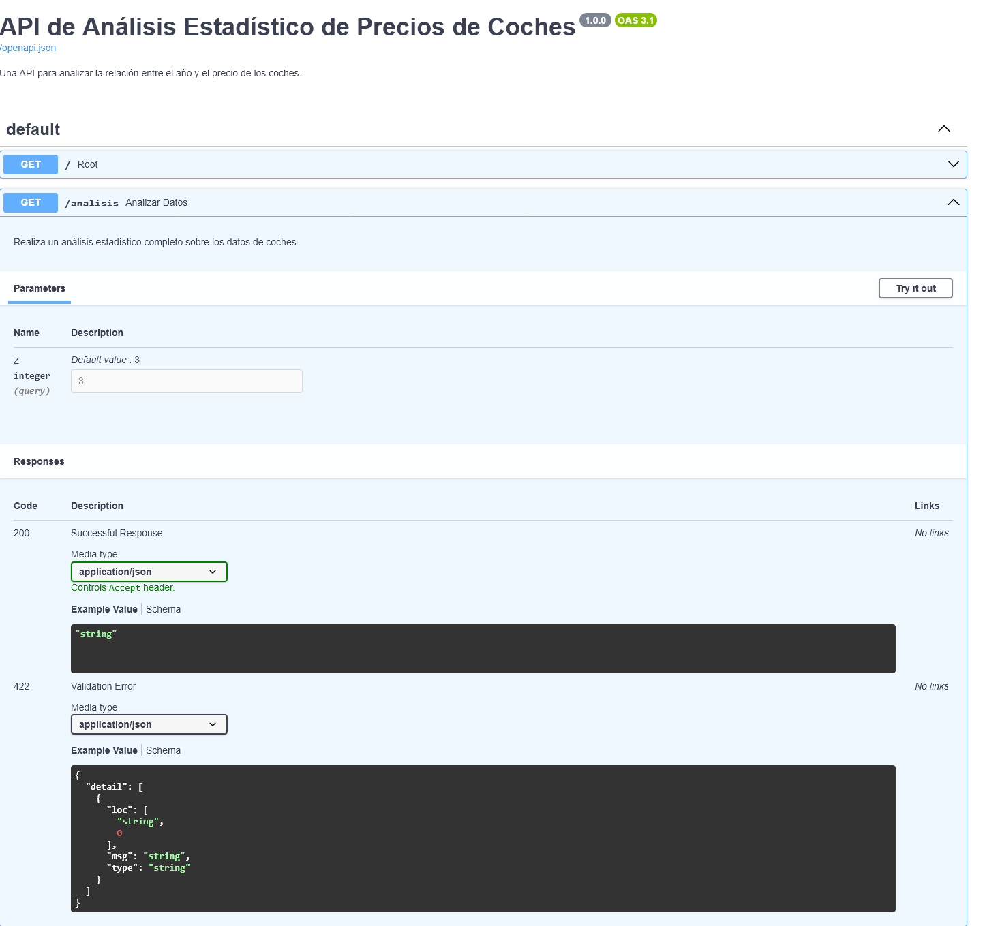

# Análisis Estadístico de Precios de Coches

Este proyecto realiza un estudio estadístico para analizar la relación entre la variable de **año** y la variable de **precio** de un conjunto de datos de coches. La lógica del análisis está encapsulada en una API web construida con FastAPI para una fácil integración y uso.

## 🚀 Características

*   **Preparación de Datos**: Carga y procesa los datos desde un archivo `data_sample.pkl`.
*   **Identificación de Outliers**: Utiliza la Puntuación Z (Z-Score) para identificar y cuantificar datos atípicos.
*   **Estandarización de Datos**: Normaliza las variables para que tengan una media de 0 y una desviación estándar de 1.
*   **Análisis de Correlación**: Calcula la correlación de Pearson para medir la relación lineal entre las variables.
*   **Transformación Logarítmica**: Aplica una transformación logarítmica a la variable de precio para analizar la relación en una escala diferente.
*   **Eficiencia**: Carga los datos en memoria una sola vez al iniciar la aplicación para un rendimiento óptimo.

## 🧩 Retos técnicos y decisiones de diseño

1. **Tratamiento de Datos Asimétricos (Skewness):** Los precios de los coches suelen presentar una distribución con sesgo positivo. Implementé una transformación logarítmica para normalizar la escala, permitiendo que la Correlación de Pearson capturara mejor la relación lineal subyacente que no era evidente en la escala original.

2. **Detección Dinámica de Outliers:** Utilicé la metodología de Z-Score parametrizada. A diferencia de un filtro estático, el endpoint permite al usuario ajustar el umbral de sensibilidad (z), permitiendo un análisis exploratorio más flexible según la calidad del dataset.

3. **Optimización de Carga (Startup Logic):** Para garantizar respuestas de baja latencia en la API, implementé la carga del archivo .pkl en el evento de inicio del servidor. Esto evita lecturas de disco redundantes en cada petición, optimizando el uso de memoria y CPU.

## 📋 Requisitos

*   Python 3.8+
*   El archivo de datos `data_sample.pkl` en la raíz del proyecto.

## ⚙️ Instalación

1.  **Clonar el repositorio** (o descargar los archivos en una carpeta):
    ```bash
    git clone <URL_DEL_REPOSITORIO>
    cd <NOMBRE_DEL_DIRECTORIO>
    ```

2.  **Crear y activar un entorno virtual** (altamente recomendado):
    ```bash
    # Para Windows
    python -m venv .venv
    ".\.venv\Scripts\activate" o ".venv/Scripts/activate"

    # Para macOS/Linux
    python3 -m venv .venv
    source .venv/bin/activate
    ```

3.  **Instalar las dependencias**:
    Usa el archivo `requirements.txt` para instalar todas las librerías necesarias.
    ```bash
    pip install -r requirements.txt
    ```

## ▶️ Uso

Para iniciar la API, ejecuta el siguiente comando en tu terminal desde la raíz del proyecto:

```bash
uvicorn main:app --reload
```

El servidor estará disponible en `http://127.0.0.1:8000`. El flag `--reload` es útil durante el desarrollo, ya que reinicia el servidor automáticamente con cada cambio en el código.

## 📡 Endpoints de la API

### Análisis Estadístico Completo

Realiza el análisis completo sobre los datos.

*   **URL**: `/analisis`
*   **Método**: `GET`
*   **Parámetros de Query**:
    *   `z` (opcional, `int`, por defecto `3`): El número de desviaciones estándar para el cálculo de outliers.

**Ejemplo de Petición**:
```
http://127.0.0.1:8000/analisis?z=2
```

**Ejemplo de Respuesta**:
```json
{
  "1. Identificacion de Outliers (z-score)": {
    "z_value": 2,
    "porcentaje_dentro_intervalo_anyos": "95.45%",
    "porcentaje_dentro_intervalo_precios": "98.33%"
  },
  "2. Correlacion de Pearson (Datos Estandarizados)": {
    "correlacion_anyos_precios": 0.6420976139230333
  },
  "3. Correlacion de Pearson (con Transformacion Logaritmica)": {
    "descripcion": "Correlación entre los años estandarizados y el logaritmo de los precios.",
    "correlacion_anyos_log_precios": 0.7323832134399728
  }
}
```

### Documentación Interactiva

FastAPI genera automáticamente una documentación interactiva (Swagger UI) donde puedes probar los endpoints directamente desde el navegador.


*   **URL**: `http://127.0.0.1:8000/docs`